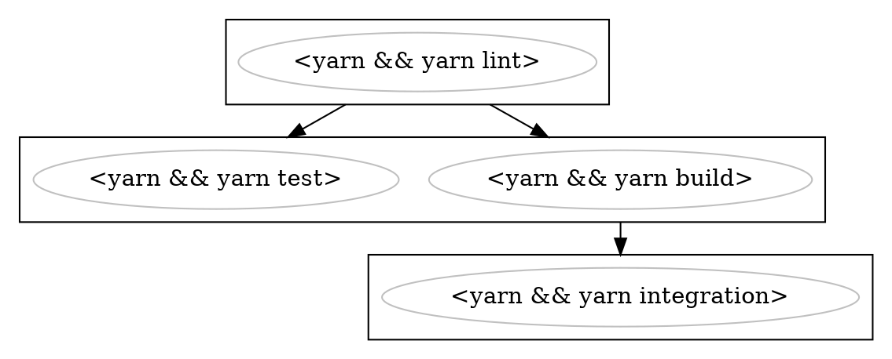

# buildkite-graph

A graph-based generator for Buildkite pipelines

This module allows you to generate Buildkite pipelines by defining their dependencies via a graph. This graph gets then serialized into the Buildkite-specific YAML format.
All standard Buildkite features are supported.

The main advantage of using this module is:

-   Easy reuse and recombination of steps
-   Defining dependencies between steps explicitly
-   Wait steps are not defined explicitly and manually managed but derived from the graph, always providing the most optimized graph
-   Steps can be defined conditionally via an acceptor function, allowing for completely dynamic pipelines
-   The graph can be serialzed into [dot](https://www.graphviz.org/) format, allowing you to see the whole of the pipeline in one glance. Clusters denote which parts of the graph are dependendent.
-   Timeouts can be defined on a per-command basis, the step will then accumulate the timeouts accordingly

## Example in a nutshell

```ts
const install = new Command('yarn', 2);

const lint = new CommandStep([install, new Command('yarn lint', 1)]);

const test = new CommandStep([install, new Command('yarn test', 2)]).dependsOn(
    lint,
);
const build = new CommandStep([
    install,
    new Command('yarn build', 5),
]).dependsOn(lint);

const integration = new CommandStep([
    install,
    new Command('yarn integration', 10),
]).dependsOn(build);

const pipeline = new Pipeline('My pipeline').add(test).add(integration);

console.log(await new YamlSerializer().serialize(pipeline));
```

> Do you see how we don't have to add the `lint` or `build`step? Because other steps depend on them, they will become part of the graph automatically in the right place. This allows you to define graphs with complex dependencies and only add the steps which have an important signal - no more manually adding auxiliary steps.

will serialize to:

```yaml
steps:
    - command:
          - yarn
          - yarn lint
      timeout_in_minutes: 3
    - wait: ~
    - command:
          - yarn
          - yarn build
      timeout_in_minutes: 7
    - command:
          - yarn
          - yarn test
      timeout_in_minutes: 4
    - wait: ~
    - command:
          - yarn
          - yarn integration
      timeout_in_minutes: 12
```

> Did you see how the `wait` step got added for you? How cool is that, hey :)

> And did you also see how the timeouts for the steps are derived from the commands?

and



which will visualize to:


> See the clusters (the square boxes)? The are legs of multiple steps in your pipeline, each separated by a wait step.
