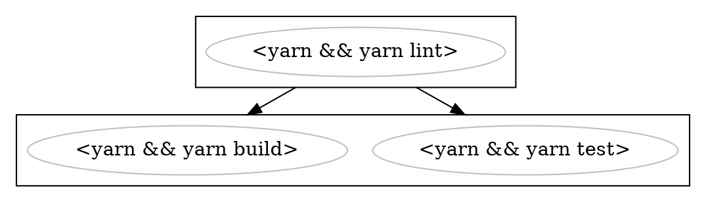

# buildkite-graph

A graph-based generator for Buildkite pipelines

This module allows you to generate Buildkite pipelines by defining their dependencies via a graph. This graph gets then serialized into the Buildkite-specific YAML format.
All standard Buildkite features are supported.

The main advantage of using this module is:

-   Easy reuse and recombination of steps
-   Defining dependencies between steps explicitly
-   Wait steps are not defined explicitly and manually managed but derived from the graph, always providing the most optimized graph
-   Steps can be defined conditionally via an acceptor function, allowing for completely dynamic pipelines
-   The graph can be serialzed into [dot](https://www.graphviz.org/) format, allowing you to see the whole of the pipeline in one glance. Clusters denote which parts of the graph are dependendent.
-   Timeouts can be defined on a per-command basis, the step will then accumulate the timeouts accordingly

## Example in a nutshell

```ts
const yarnInstall = new Command('yarn', 2);

const lintStep = new Step([yarnInstall, new Command('yarn lint', 1)]);
const testStep = new Step([yarnInstall, new Command('yarn test', 5)]).dependsOn(
    lintStep,
);
const buildStep = new Step([
    yarnInstall,
    new Command('yarn build', 10),
]).dependsOn(lintStep);

const pipeline = new Pipeline('My pipeline').add(testStep).add(buildStep);

console.log(new YamlSerializer().serialize(pipeline));
```

will serialize to:

```yaml
steps:
    - command:
          - yarn
          - yarn lint
      timeout_in_minutes: 3
    - wait: ~
    - command:
          - yarn
          - yarn test
      timeout_in_minutes: 7
    - command:
          - yarn
          - yarn build
      timeout_in_minutes: 12
```

> Do you see how the `wait` step got added for you? How cool is that, hey :)

and



which will visualize to:


